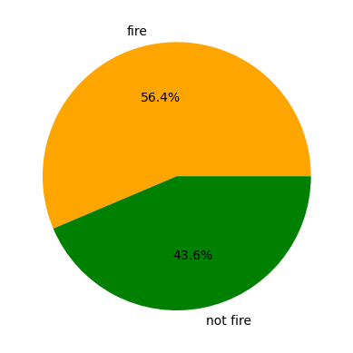
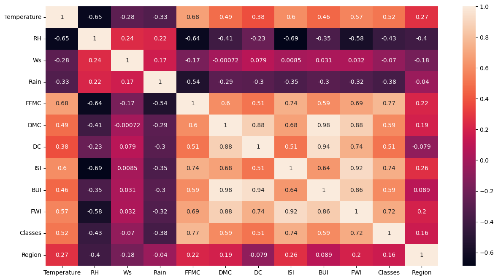
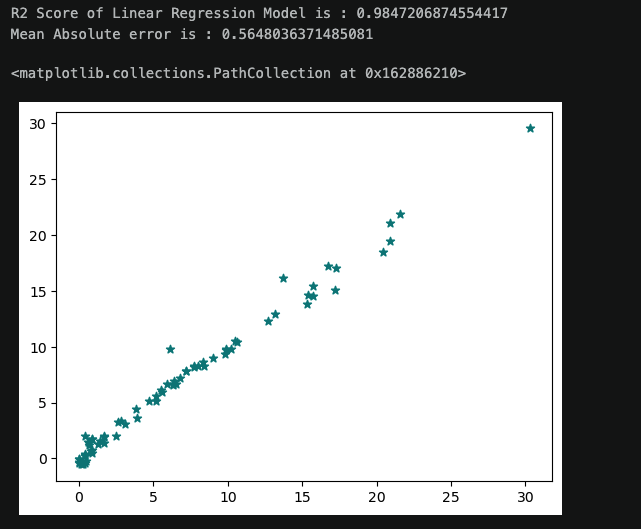
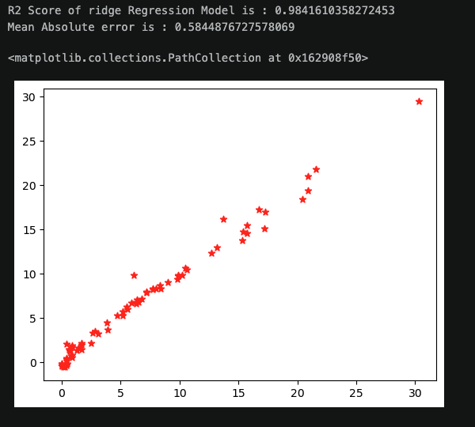
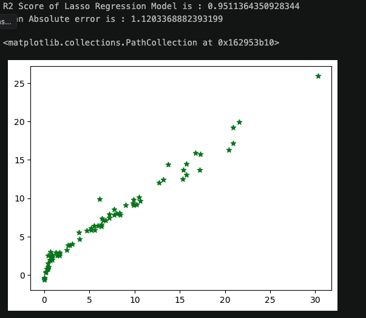
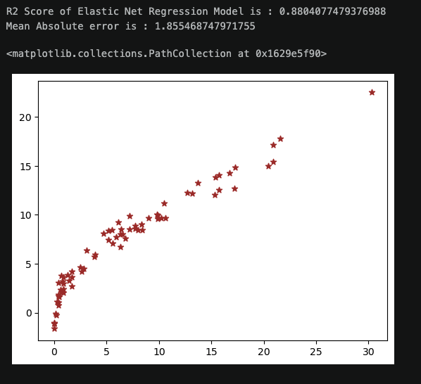
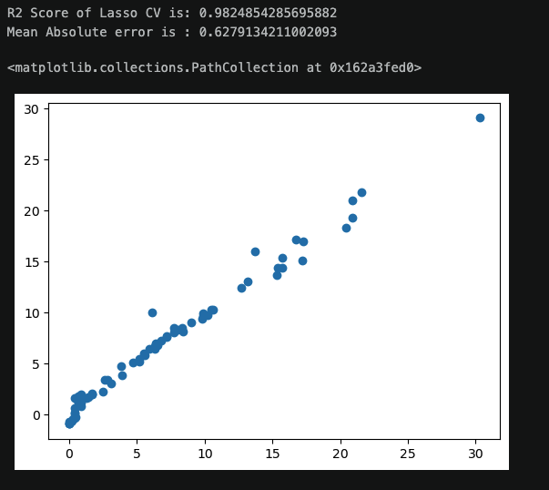
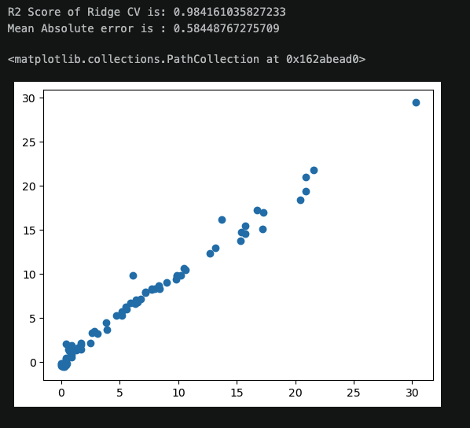
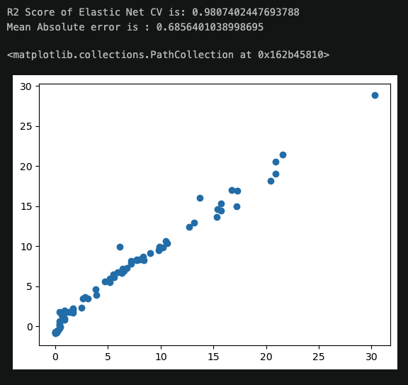

# 🔥 Algerian Forest Fire FWI Prediction

## 📌 Overview

This is my first complete **End-to-End Machine Learning project**, built using the **Algerian Forest Fires Dataset**.

The main objective of this project is to predict the **Fire Weather Index (FWI)** using weather and fire-weather-related features.

I started this project by exploring and preprocessing the dataset, performing Exploratory Data Analysis (EDA), testing multiple Machine Learning regression algorithms, evaluating their performance, and selecting a model for deployment.

I then took the project beyond the Jupyter Notebook by creating a **Flask web application**, saving the trained Machine Learning model and StandardScaler using Pickle, and deploying the application to **AWS Elastic Beanstalk using AWS CodePipeline**.

This project helped me understand how an ML model can move from experimentation in a notebook to a working cloud-based application.

---

## 🎯 Objective

The objective of this project is to predict the **Fire Weather Index (FWI)** based on environmental and fire-weather features.

Since FWI is a continuous numerical value, this is treated as a **Regression Problem**.

### Target Variable

**FWI — Fire Weather Index**

---

## 📊 Dataset

The project uses the **Algerian Forest Fires Dataset**, which contains observations from two regions:

- Bejaia Region
- Sidi-Bel Abbes Region

The dataset contains meteorological and fire-weather-related variables.

### Features Used

- Temperature
- Relative Humidity (RH)
- Wind Speed (Ws)
- Rain
- FFMC
- DMC
- ISI
- Classes
- Region

### Target

- FWI

---

# 🔄 Project Workflow

```text
Algerian Forest Fire Dataset
            ↓
      Data Cleaning
            ↓
 Exploratory Data Analysis
            ↓
    Feature Selection
            ↓
     Train/Test Split
            ↓
     Feature Scaling
            ↓
    Model Development
            ↓
     Model Evaluation
            ↓
    Model Comparison
            ↓
    Ridge Regression
            ↓
  Model Serialization
            ↓
      Flask Application
            ↓
       AWS Deployment
```

---

# 🧹 Data Preprocessing

Before training the Machine Learning models, I performed several preprocessing steps on the dataset.

The preprocessing workflow included:

- Loading the dataset using Pandas
- Inspecting the dataset
- Handling missing values
- Cleaning column names
- Cleaning inconsistent categorical values
- Converting data types
- Encoding categorical variables
- Selecting relevant features
- Separating independent and dependent variables
- Splitting the dataset into training and testing data
- Applying feature scaling

The target variable for the regression problem was:

```text
FWI
```

---

# 🔎 Exploratory Data Analysis

I performed Exploratory Data Analysis to understand the structure of the dataset and identify relationships between different variables.

The analysis included:

- Class distribution
- Fire frequency analysis
- Regional analysis
- Monthly analysis
- Correlation analysis
- Visualization of relationships between variables

---

# 📊 Class Distribution

The class distribution was visualized using a pie chart.



The dataset contains approximately:

- **56.4% Fire**
- **43.6% Not Fire**

This visualization helped me understand the distribution of fire and non-fire observations within the dataset.

---

# 🔥 Fire Analysis — Bejaia Region

I analyzed the distribution of fire and non-fire observations across different months for the Bejaia region.


This visualization helped me understand how fire frequency changes across the months represented in the dataset.

---

# 🔥 Fire Analysis — Sidi-Bel Abbes Region

I also analyzed fire frequency across different months for the Sidi-Bel Abbes region.


This provided another perspective on how fire observations were distributed across the different regions and months.

---

# 📈 Correlation Analysis

I created a correlation matrix to understand the relationships between the numerical features.



The correlation analysis showed strong relationships between several of the fire-weather-related variables.

This analysis helped me understand the relationships between the predictors before building the regression models.

---

# ⚙️ Feature Scaling

For feature scaling, I used **StandardScaler** from Scikit-learn.

```python
from sklearn.preprocessing import StandardScaler

scaler = StandardScaler()

x_train_scaled = scaler.fit_transform(x_train)
x_test_scaled = scaler.transform(x_test)
```

The scaler was fitted on the training data and then applied to the test data.

The trained scaler was later saved as a Pickle file so that the same preprocessing could be applied to new data during deployment.

---

# 🤖 Machine Learning Models

I experimented with multiple regression algorithms to compare their performance.

The models included:

- Linear Regression
- Ridge Regression
- Lasso Regression
- Elastic Net Regression
- LassoCV
- RidgeCV
- ElasticNetCV

This helped me understand how different regression algorithms perform on the same dataset.

---

# 📏 Model Evaluation

Because this is a regression problem, I used:

### R² Score

R² Score measures how well the model explains the variation in the target variable.

A value closer to 1 indicates that the model explains a large proportion of the variation in the target variable.

### Mean Absolute Error (MAE)

MAE measures the average absolute difference between the actual and predicted values.

A lower MAE indicates smaller prediction errors.

---

# 📊 Model Performance

The models produced the following results during my experiments:

| Model | R² Score | MAE |
|---|---:|---:|
| Linear Regression | 0.9847 | 0.5648 |
| Ridge Regression | 0.9842 | 0.5845 |
| Lasso Regression | 0.9511 | 1.1203 |
| Elastic Net Regression | 0.8804 | 1.8555 |
| LassoCV | 0.9825 | 0.6279 |
| RidgeCV | 0.9842 | 0.5845 |
| ElasticNetCV | 0.9807 | 0.6856 |

> These results represent the experiments performed in this project on the available dataset and evaluation setup.

---

# 📉 Regression Model Visualizations

## Linear Regression



---

## Ridge Regression



---

## Lasso Regression



---

## Elastic Net Regression



---

## Lasso Cross Validation



---

## Ridge Cross Validation



---

## Elastic Net Cross Validation



---

# 🏗️ Model Selected for Deployment

After experimenting with different regression models, I selected **Ridge Regression** for the deployment stage of this project.

The final prediction workflow is:

```text
Input Features
      ↓
StandardScaler
      ↓
Ridge Regression
      ↓
FWI Prediction
```

The two important files used for deployment are:

```text
models/
├── ridge.pkl
└── scaler.pkl
```

The Ridge Regression model was saved as `ridge.pkl`, while the trained StandardScaler was saved as `scaler.pkl`.

---

# 💾 Model Serialization

After training the model, I serialized the trained model and scaler using Python's Pickle library.

This allows the application to load the already-trained model instead of retraining it every time the Flask application starts.

The deployment workflow is:

```text
Train Model
     ↓
Train StandardScaler
     ↓
Save Ridge Model
     ↓
Save Scaler
     ↓
Load Model in Flask
     ↓
Receive New Input
     ↓
Scale Input
     ↓
Generate Prediction
```

---

# 🌐 Flask Web Application

After completing the Machine Learning workflow, I created a Flask application to serve the trained model.

The Flask application loads the saved Ridge Regression model and StandardScaler.

The application accepts the following inputs:

- Temperature
- RH
- Ws
- Rain
- FFMC
- DMC
- ISI
- Classes
- Region

The input values are received through an HTML form.

The Flask application then:

1. Receives the input values
2. Converts them into numerical values
3. Applies the saved StandardScaler
4. Passes the scaled data to the Ridge Regression model
5. Generates the FWI prediction
6. Displays the prediction on the web page

---

# 🔄 Flask Prediction Workflow

```text
              User
               ↓
        HTML Input Form
               ↓
       Flask Application
               ↓
       Receive Input Data
               ↓
        StandardScaler
               ↓
       Ridge Regression
               ↓
         FWI Prediction
               ↓
       Display Prediction
```

---

# ☁️ AWS Deployment

To take the project beyond local development, I deployed the Flask application using AWS.

The deployment uses:

- **GitHub**
- **AWS CodePipeline**
- **AWS Elastic Beanstalk**

The overall deployment workflow is:

```text
GitHub Repository
       ↓
AWS CodePipeline
       ↓
AWS Elastic Beanstalk
       ↓
Flask Application
       ↓
Ridge Regression Model
       ↓
FWI Prediction
```

This allowed me to connect my source code repository with an AWS deployment environment and move the Machine Learning application from my local development environment to the cloud.

---

# 🔁 CI/CD Pipeline

The project uses AWS CodePipeline to connect the GitHub repository with the AWS Elastic Beanstalk environment.

```text
              GitHub
                 ↓
          Source Stage
                 ↓
        AWS CodePipeline
                 ↓
         Deploy Stage
                 ↓
     AWS Elastic Beanstalk
                 ↓
       Flask ML Application
```

This was an important learning experience because it introduced me to the deployment and CI/CD side of Machine Learning projects.

---

# 🏛️ End-to-End Architecture

```text
                    ┌───────────────────────┐
                    │ Algerian Forest Fire │
                    │       Dataset        │
                    └───────────┬───────────┘
                                ↓
                    ┌───────────────────────┐
                    │ Data Cleaning & EDA  │
                    └───────────┬───────────┘
                                ↓
                    ┌───────────────────────┐
                    │ Feature Selection &  │
                    │ Feature Scaling      │
                    └───────────┬───────────┘
                                ↓
                    ┌───────────────────────┐
                    │ Regression Models    │
                    │                       │
                    │ Linear Regression    │
                    │ Ridge                │
                    │ Lasso                │
                    │ Elastic Net          │
                    │ Cross Validation     │
                    └───────────┬───────────┘
                                ↓
                    ┌───────────────────────┐
                    │ Model Evaluation     │
                    │ R² / MAE             │
                    └───────────┬───────────┘
                                ↓
                    ┌───────────────────────┐
                    │ Ridge Regression     │
                    │ + StandardScaler     │
                    └───────────┬───────────┘
                                ↓
                    ┌───────────────────────┐
                    │   Pickle Files       │
                    │                       │
                    │ ridge.pkl             │
                    │ scaler.pkl            │
                    └───────────┬───────────┘
                                ↓
                    ┌───────────────────────┐
                    │ Flask Web Application │
                    └───────────┬───────────┘
                                ↓
                    ┌───────────────────────┐
                    │    HTML Frontend     │
                    └───────────┬───────────┘
                                ↓
                           GitHub
                                ↓
                    ┌───────────────────────┐
                    │   AWS CodePipeline   │
                    └───────────┬───────────┘
                                ↓
                    ┌───────────────────────┐
                    │ AWS Elastic Beanstalk│
                    └───────────┬───────────┘
                                ↓
                       Deployed Application
```

---

# 📁 Project Structure

```text
Algerian-Forest-Fire-Prediction/
│
├── notebooks/
│   └── Algerian_forest.ipynb
│
├── models/
│   ├── ridge.pkl
│   └── scaler.pkl
│
├── templates/
│   ├── index.html
│   └── home.html
│
├── images/
│   ├── Class_distribution.png
│   ├── Correlation_heatmap.png
│   ├── Bejaia Regions Fire Analysis.png
│   ├── Fire Analysis of Sidi Bell Regions.png
│   ├── Elastic_NET_CV.png
│   ├── Elastic_Net_Regression.png
│   ├── Lasso_cv.png
│   ├── Lasso_Regression.png
│   ├── Linear_regression.png
│   ├── Ridge_cv.png
│   └── Ridge_Regression.png
│
├── application.py
├── requirements.txt
├── README.md
└── .gitignore
```

---

# 🛠️ Technologies Used

### Programming Language

- Python

### Data Analysis

- Pandas
- NumPy

### Data Visualization

- Matplotlib
- Seaborn

### Machine Learning

- Scikit-learn

### Regression Algorithms

- Linear Regression
- Ridge Regression
- Lasso Regression
- Elastic Net
- LassoCV
- RidgeCV
- ElasticNetCV

### Preprocessing

- StandardScaler

### Web Development

- Flask
- HTML

### Model Serialization

- Pickle

### Version Control

- Git
- GitHub

### Cloud Deployment

- AWS CodePipeline
- AWS Elastic Beanstalk

---

# 🚀 How to Run the Project Locally

## 1. Clone the Repository

```bash
git clone <YOUR_GITHUB_REPOSITORY_URL>
```

## 2. Navigate to the Project

```bash
cd Algerian-Forest-Fire-Prediction
```

## 3. Create a Virtual Environment

```bash
python -m venv venv
```

## 4. Activate the Virtual Environment

### macOS / Linux

```bash
source venv/bin/activate
```

### Windows

```bash
venv\Scripts\activate
```

## 5. Install Dependencies

```bash
pip install -r requirements.txt
```

## 6. Run the Flask Application

```bash
python application.py
```

The application will run on:

```text
http://localhost:8080
```

---

# 📦 Main Dependencies

```text
numpy
pandas
matplotlib
seaborn
scikit-learn
flask
```

The complete dependency list is available in:

```text
requirements.txt
```

---

# 🧠 Key Learning Outcomes

This project helped me gain practical experience in different areas of the Machine Learning lifecycle.

### Data Science

- Data cleaning
- Handling missing values
- Data exploration
- Exploratory Data Analysis
- Data visualization
- Correlation analysis
- Feature selection

### Machine Learning

- Regression problems
- Train/test splitting
- Feature scaling
- Linear Regression
- Ridge Regression
- Lasso Regression
- Elastic Net
- Cross-validation
- R² Score
- Mean Absolute Error

### Deployment

- Model serialization
- Pickle
- Flask
- HTML forms
- Connecting frontend with Machine Learning models
- Cloud deployment

### Cloud & DevOps

- Git
- GitHub
- AWS CodePipeline
- AWS Elastic Beanstalk
- CI/CD workflow

---

# 💡 What I Learned

The biggest lesson from this project was that **building a Machine Learning model is only one part of an end-to-end Machine Learning project**.

Before this project, I was mainly focused on learning Python, data analysis and Machine Learning algorithms.

This project helped me understand how these individual concepts connect together:

```text
Data
 ↓
Data Analysis
 ↓
Feature Engineering
 ↓
Machine Learning
 ↓
Model Evaluation
 ↓
Model Serialization
 ↓
Flask Application
 ↓
Cloud Deployment
```

I also learned that a Machine Learning project becomes much more meaningful when the trained model can actually be integrated into an application and made accessible through a deployment environment.

---

# ⚠️ Project Considerations

The model performance shown in this README is based on the experiments performed on this dataset and the corresponding evaluation setup.

The dataset contains several fire-weather variables that have strong relationships with FWI. Therefore, the high R² scores should be interpreted within the context of this particular dataset and feature set.

The current application also uses `Classes` and `Region` as input features.

In a future version, I would further investigate the feature availability at prediction time and evaluate whether all current features should remain part of the production model.

---

# 🔮 Future Improvements

I would like to continue improving this project by adding:

- Better frontend UI/UX
- Input validation
- A complete Scikit-learn Pipeline
- More extensive hyperparameter tuning
- More robust model validation
- Additional feature engineering
- Testing with unseen external data
- REST API for predictions
- Docker containerization
- Improved CI/CD workflow
- Application monitoring
- Model monitoring
- Better production error handling

---

# 🙌 Project Reflection

This project represents an important milestone in my journey of learning **Data Science and Machine Learning**.

It challenged me to move beyond simply training a model and helped me understand the complete workflow of taking a Machine Learning project from an initial dataset to a deployed application.

I worked through:

**Data → EDA → Feature Selection → Model Training → Model Evaluation → Model Serialization → Flask → GitHub → AWS CodePipeline → AWS Elastic Beanstalk**

For me, the most important takeaway is:

> **A Machine Learning model is not the end of the project — it is one component of a complete Machine Learning solution.**

This project has strengthened my understanding of both the theoretical and practical sides of Machine Learning, and I am looking forward to applying these lessons to my upcoming projects.

---

# 🚀 What's Next?

This is only the beginning of my practical Machine Learning journey.

I will continue working on projects that help me strengthen my skills in:

**Python → Data Analysis → Statistics → Machine Learning → Deployment → Cloud**

My goal is to keep moving from **learning concepts to building complete, practical solutions.**

---

## 👨‍💻 Author:
Ashish Singh (MSc Computer Science)
Aspiring Data Scientist

I am currently developing my skills in **Data Science, Machine Learning and Python**, with a focus on combining theoretical knowledge with practical implementation.

This project is one of my first complete end-to-end Machine Learning projects, and it has been an important step forward in my learning journey.

---

⭐ If you find this project interesting, feel free to explore the repository.
